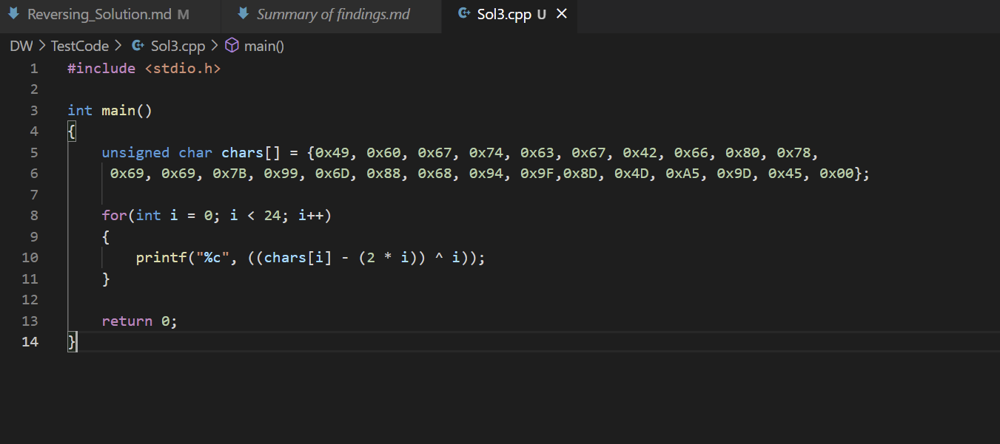
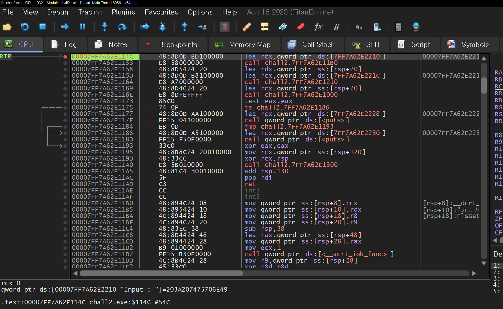

# 1 Reversing Basic Challenge #0

https://dreamhack.io/wargame/challenges/14

이 문제는 사용자에게 문자열 입력을 받아 정해진 방법으로 입력값을 검증하여 correct 또는 wrong을 출력하는 프로그램이 주어집니다.

해당 바이너리를 분석하여 correct를 출력하는 입력값을 찾으세요!

획득한 입력값은 DH{} 포맷에 넣어서 인증해주세요.

예시) 입력 값이 Apple_Banana일 경우 flag는 DH{Apple_Banana}

## Solution

해당 exe file을 다운로드 받은 다음에 Text editor로 문서를 연다.

상기 이미지 내 값을 ASCII로 읽으면

43 6F 6D 70 61 72 33 5F 74 68 65 5F 73 74 72 31 6E 67
Compar3_the_str1ng

라는 값을 읽을 수 있으며 해당 값이 flag이다.

 
 

# 2 Reversing Basic Challenge #1

https://dreamhack.io/wargame/challenges/15

이 문제는 사용자에게 문자열 입력을 받아 정해진 방법으로 입력값을 검증하여 correct 또는 wrong을 출력하는 프로그램이 주어집니다.

해당 바이너리를 분석하여 correct를 출력하는 입력값을 알아내세요.

획득한 입력값은 DH{} 포맷에 넣어서 인증해주세요.

예시) 입력 값이 Apple_Banana일 경우 flag는 DH{Apple_Banana}

## Solution

이 문제도 text editor로 찾을 수 도 있지만, 이번에는 x64 dbg로 정답을 찾아보도록 하자.

x64 dbg에 exe file을 넣고 ASICC 검색 기능을 사용하면, 이렇게 해당 프로그램에 단서를 찾을 수 있다.

INPUT 쪽을 클릭해서 해당 주소로 이동해보자.

해당 코드를 읽어보면, Input으로 256 byte string 입력값을 받고, 위의 이미지 내에 Call chall1.7FF7B59A10000 주소 내에 함수에서 해당 Input을 비교하는 함수가 있다는 것을 알 수 있다. 

해당 주소를 점프하면 비교 할 String 값이 보인다. {Compa~로 시작하는 문장 }

 
 

# 3 Reversing Basic Challenge #3

https://dreamhack.io/wargame/challenges/17

이 문제는 사용자에게 문자열 입력을 받아 정해진 방법으로 입력값을 검증하여 correct 또는 wrong을 출력하는 프로그램이 주어집니다.

해당 바이너리를 분석하여 correct를 출력하는 입력값을 찾으세요!

획득한 입력값은 DH{} 포맷에 넣어서 인증해주세요.

예시) 입력 값이 Apple_Banana일 경우 flag는 DH{Apple_Banana}

## Solution

이번 문제는 단순하게 disassembler로 쉽게 문제가 해결되지는 않았다.

우선 접근 방법은 2번 문제와 유사하게 진행되는데 실제 String 비교 함수에 들어갔을 때가 문제였다. 

비교 함수 내부를 어셈블리코드 자체로 해석할 수도 있지만, 이런 경우에는 decompiler를 사용하게 효과적이다. 해당 함수영역을 잡고 decompiler를 적용하면 아래와 같이 코드를 뽑아낼 수 있다. 

해당 함수의 While문을 살펴보면, v3가 index이며, 0x7FF67BB13000에 있는 uin8짜리 24개 배열에 담긴 특정 값을 가져와서 비교 연산을 하고 있음을 알 수 있다. 

비교 연산의 수식을 살펴보면, rcx4 + rdx5 * 2이다.

좀 더 풀어서 써보면, (rcx + index) ^ index + index * 2 이다.

조건문의 양변을 가지고 정리를 해보면, 

0x7FF67BB13000[index] = (rcx + index) ^ index + index * 2

0x7FF67BB13000[index] - index * 2 = (rcx + index) ^ index 

(0x7FF67BB13000[index] - index * 2) ^ index = rcx + index

여기서 rcx는 input string의 주소이다.

자 이제 0x7FF67BB13000 내부의 데이터가 뭔지 알면 역연산을 이용해 코드를 간단히 작성해서 답을 찾을 수 있다. 

0x7FF67BB13000의 값을 찾아보면 아래와 같다. 

 
총 24개의 데이터를 가지고 역연산 코드를 작성해보자.
 
 
 

코드를 작성하면 위와 같이 이제 어떤 답이 들어왔을 때 Correct가 되는지 확인할 수 있다. 

이제 빌드해서 코드를 돌려보자.

자 이렇게 답을 구할 수 있었다. 

 
 
 

# Reversing Basic Challenge #2

이 문제는 사용자에게 문자열 입력을 받아 정해진 방법으로 입력값을 검증하여 correct 또는 wrong을 출력하는 프로그램이 주어집니다.

해당 바이너리를 분석하여 correct를 출력하는 입력값을 찾으세요!

획득한 입력값은 DH{} 포맷에 넣어서 인증해주세요.

예시) 입력 값이 Apple_Banana일 경우 flag는 DH{Apple_Banana}

## Solution

앞 서 푼 문제와 거의 유사하다

우선 ASCII code로 Input 입력 받는 곳을 찾아가 보자.

어셈블리 코드를 살펴보면 이전 문제와 마찬가지로 256byte string input을 받아서 특정 함수로 점프하는 것을 확인할 수 있다. 

해당 함수의 주소는 0x7FF7A62E1000이다.

해당 함수 안으로 들어가서 보면, 

위와 같은 어셈블리 코드를 볼 수 있다. 

어셈블리 코드를 살펴보면, rax가 처음에는 0의 값을 가지고 있다가 1씩 증가하는 루프를 돌고 12가 되면 루프가 끝나는 구조이다.

0x12는 17이고, 0부터 시작하면 18번이다.

루프를 도는 동안에 ds : [7FF7A62E3000]에 있는 값을 비교함을 알 수 있다. 

해당 주소를 dump 뜨면 아래와 같다. 

