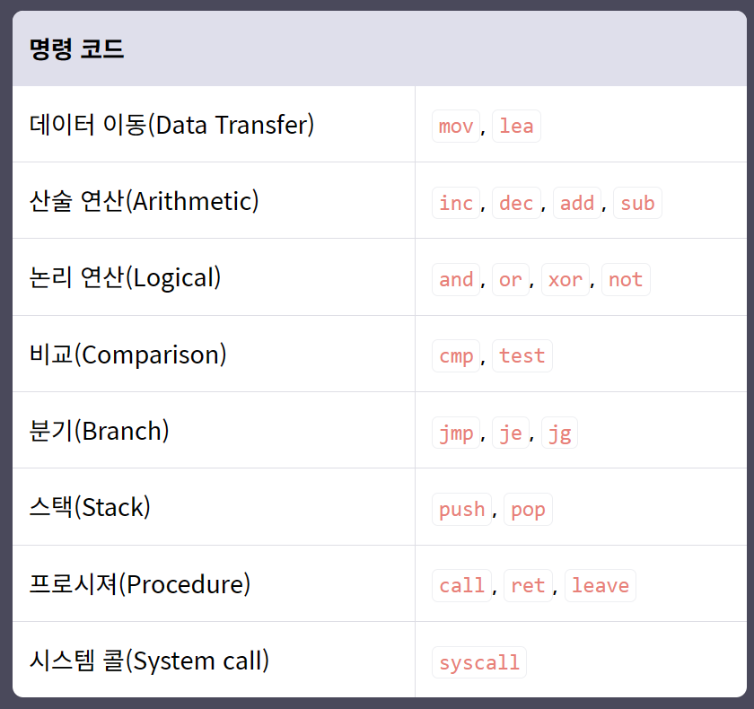

# Introduction Reverse Engineering

보통 SW 입장에서 리버스엔지니어링은 완성된 프로그램으로 부터 소스코드를 추적하는 일련의 과정을 의미한다.

리버시의 용도는 여러가지가 있는데 좋은 의미에서는 보안성 평가 혹은 악성코드 분석에 사용된다. 나쁜 의미에서는 키젠 프로그램이나 시리얼 넘버 생성기 혹은 크랙을 이용해서 프로그램을 불법적으로 사용하고자 할 때 이용되는 경우가 있다. 

 
 
 

# Background: Binary

Binary는 프로그램이 컴퓨터의 저장 장치에 저장되는 형태를 의미한다. 

## Compile Whole Process

C코드로 작성된 코드는 일반적으로 전처리(Preprocess), 컴파일(Compile), 어셈블(Assemble), 링크(Link)의 과정을 거쳐 Binary로 번역된다.

* Compile의 좀 더 정확한 의미는 어떤 언어로 작성된 Source Code를 다른 언어의 Object Code로 번역하는 것이다. Source Code를 Assembly Language로 혹은 Machine Language로 번역하는 것 모두 Compile이라고 볼 수 있다. 

### Preprocess

Compiler가 Source code를 Assembly Language로 Compile하기 전에 필요한 형식을 가공

1. 주석 제거
2. MACRO 치환
3. File 병합 

### Compile

Source Code를 Assembly Language로 번역, 이 때 Compiler는 Source code의 Syntax를 검사한다. 검사 시 Syntax error를 발견하면 Compile을 중단하고 Error를 표시한다.

일반적으로 Compile 시에는 최적화 옵션을 추가할 수 있다. 

### Assemble 

Copile로 생성된 Assembly Language를 elf 형식의 object file로 변환하는 과정이다. 여기서부터는 사람이 직관적으로 이해하기가 어려워진다. 

### Link

Link는 여러 Object file을 실행가능한 binary로 만드는 과정이다. Link 과정에서 각 코드 내에 있는 여러 함수들간의 연결을 지어준다. 

 
 
 
 

## Disassemble

binary를 분석하려면, binary를 직접 읽어야 한다. 하지만 이 자체를 직관적으로 이해하기란 어렵다. 

따라서 이 binary를 그래도 이해가 가능한 assembly language로 번역하는 과정을 disassemble이라고 부른다. 

## Decompile

disassemble로 binary를 분석하기가 이전보다 쉬워졌지만, 규모가 큰 경우에는 쉽게 코드를 파악하기는 여전히 어려웠다. 

그래서 이를 좀 더 고급언어로 번역하는 Decompiler가 등장하였다. 

하지만 문제는 binary와 assembly language는 거의 오차 없이 일대일로 번역이 가능하지만 high level language와 assembly language 간에는 이런 대응관계가 존재하지 않는다.

따라서 변수 이름이나 함수 이름은 사라지게 되고 코드 일부분의 경우 최적화옵션에 의해 손실되어 원본을 그대로 복원할 수 없기도 하다. 

하지만 이러한 오차가 동작에 왜곡을 주지는 않기 때문에 분석 자체에는 영향을 주지 않는다. 

사용 가능한 툴로는 Hex Rays, Ghidra 등이 있으며 IDA Freeware도 사용가능하다. 

# Computer Architecture X86-64

32bit니, 64bit니 하는 것은 CPU가 한 번에 처리할 수 있는 데이터 단위를 의미한다. 이것을 우리는 WORD라고 부른다. 

WORD가 크면 유리한 점은 Virtual Memory를 크게 가질 수 있다는 점이다. 

x86-64 Architecture : Register는 아래와 같다.

## 범용 레지스터
rax(accumulator register) : 함수의 반환 값
rbx(base register) : x86에서는 주된 용도 없음
rcx(counter register) : 반복문의 반복 횟수, 각종 연산의 시행 횟수
rdx(data register) : x86에서는 주된 용도 없음
rsi(source index) : 데이터를 옮길 때 원본을 가리키는 포인터
rdi(destination index) : 데이터를 옮길 때 목적지를 가리키는 포인터 
 
 

### 세그먼트 레지스터
cs, ss, ds, es, fs, gs 이며 각 16bit

cs,ds,ss 레지스터는 코드 영역, 데이터, 스텍 메모리영역을 가리킬 때, 나머지 레지스터는 운영체제 별로 용도를 결정할 수 있게 제작된 세그먼트 레지스터이다. 
 
 

### 명령어 포인터 레지스터
rip 이며 8bit이다. 
 
 

### 플레그 레지스터
RFLAGS라고 불리는 64bit 레지스터가 있다. 
이 레지스터는 각 bit별로 CPU의 상태를 표현한다. 

CF(Carry Flag) : 부호없는 수의 연산 결과가 비트 범위를 넘을 경우 설정

ZF(Zero Flag) : 연산의 결과가 0일 경우 설정

SF(Sign Flag) : 연산의 결과가 음수일 경우 설정

OF(Overflow Flag) : 부호있는 수의 연산 결과가 비트 범위를 넘을 경우 설정

# Windows Memory Layout

## section
 : text, data, rdata로 나누어진다. 

 
 

 * .text : 실행할 수 있는 machine code 영역
 * .data : 컴파일 시점에 값이 정해진 전역변수
 * .rdata : 컴파일 시점에 값이 정해진 전역상수와 참조한 DLL 및 외부함수 정보

 

## stack
 : 지역 변수나 함수의 리턴 주소가 저장된다. 
 
## heap
 : 동적 할당한 영역

 
 

# x86 Assembly

ISA(Instruction Set Architecture) : 명령어 집합구조

피연산자 

* 상수 (Immediate Value)
* 레지스터 (Register)
* 메모리 (Memory)

자료형 WORD의 크기가 2byte인 이유

초기에 인텔은 WORD 크기가 16bit인 IA-16 아키텍쳐를 개발하였다. 그렇기 때문에 어셈블리어에서도 WORD를 16bit 자료형으로 정의하는 것이 자연스러웠다.

이후에 개발된 IA-32, x86-64 아키텍쳐는 CPU의 WORD가 32bit, 64bit로 확장되었다. 

그러나 인텔은 WORD 자료형 크기를 16bit로 유지했다. 왜냐면 자료형 크기를 변경하면 기존 프로그램 호환이 어려웠기 때문이다.

그래서 WORD 자료형은 그대로 유지하고, DWORD(Double Word, 32bit), QWORD(Quad Word, 64bit)자료형을 추가로 만들었다.